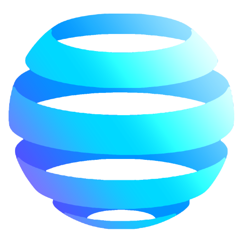

<!-- PROJECT SHIELDS -->
[![Contributors][contributors-shield]][contributors-url]
[![Forks][forks-shield]][forks-url]
[![Stargazers][stars-shield]][stars-url]
[![Issues][issues-shield]][issues-url]
[![LinkedIn][linkedin-shield]][linkedin-url]

<!-- PROJECT LOGO -->
 

  

<h3 align="center">Vortex Research</h3>

  

    Quantitative Trading Firm
     
    <a href="https://github.com/owenAPI/VortexResearch"><strong>Some of Our Models »</strong></a>
     
     
    <a href="https://github.com/owenAPI/VortexResearch/issues">Report Bug</a>
    ·
    <a href="https://github.com/owenAPI/VortexResearch/issues">Request Feature</a>
  

<!-- TABLE OF CONTENTS -->

  
Table of Contents

  <ol>
    <li>
      <a href="#about">About</a>
      <ul>
        <li><a href="#built-using">Built Using</a></li>
      </ul>
    </li>
    <li><a href="#contributing">Contributing</a></li>
    <li><a href="#contact">Contact</a></li>
    <li><a href="#acknowledgments">Acknowledgments</a></li>
  </ol>

<!-- ABOUT THE PROJECT -->
## About

Vortex Research is the quantitative trading branch of OTTR Capital. Here, you can browse some of our models, and learn more about our investment philosophies and strategies.

(<a href="#readme-top">Back to Top</a>)

### Built Using

* [![Next][Next.js]][Next-url]
* [![React][React.js]][React-url]
* [![Bootstrap][Bootstrap.com]][Bootstrap-url]
* [![JQuery][JQuery.com]][JQuery-url]

(<a href="#readme-top">Back to Top</a>)

<!-- CONTRIBUTING -->
## Contributing

Any contributions are **greatly appreciated**.

If you have a suggestion that would make us better, please fork the repo and create a pull request. You can also simply open an issue with the tag "enhancement".

1. Fork the Project
2. Create your Feature Branch (`git checkout -b feature/NewFeature`)
3. Commit your Changes (`git commit -m 'Add NewFeature'`)
4. Push to the Branch (`git push origin feature/NewFeature`)
5. Open a Pull Request

(<a href="#readme-top">Back to Top</a>)

<!-- CONTACT -->
## Contact

Twitter - [@ottrCapital](https://twitter.com/ottrCapital) - info@ottr.site

Github: [https://github.com/owenAPI/VortexResearch](https://github.com/owenAPI/VortexResearch)

(<a href="#readme-top">Back to Top</a>)

<!-- ACKNOWLEDGMENTS -->
## Acknowledgments

* [0xOwen](https://x.com/0xOwen)

(<a href="#readme-top">Back to Top</a>)

<!-- MARKDOWN LINKS & IMAGES -->
<!-- https://www.markdownguide.org/basic-syntax/#reference-style-links -->
[contributors-shield]: https://img.shields.io/github/contributors/owenAPI/VortexResearch.svg?style=for-the-badge
[contributors-url]: https://github.com/owenAPI/VortexResearch/graphs/contributors
[forks-shield]: https://img.shields.io/github/forks/owenAPI/VortexResearch.svg?style=for-the-badge
[forks-url]: https://github.com/owenAPI/VortexResearch/network/members
[stars-shield]: https://img.shields.io/github/stars/owenAPI/VortexResearch.svg?style=for-the-badge
[stars-url]: https://github.com/owenAPI/VortexResearch/stargazers
[issues-shield]: https://img.shields.io/github/issues/owenAPI/VortexResearch.svg?style=for-the-badge
[issues-url]: https://github.com/owenAPI/VortexResearch/issues
[linkedin-shield]: https://img.shields.io/badge/-LinkedIn-black.svg?style=for-the-badge&logo=linkedin&colorB=555
[linkedin-url]: https://linkedin.com/company/ottrCapital
[product-screenshot]: images/screenshot.png
[Next.js]: https://img.shields.io/badge/next.js-000000?style=for-the-badge&logo=nextdotjs&logoColor=white
[Next-url]: https://nextjs.org/
[React.js]: https://img.shields.io/badge/React-20232A?style=for-the-badge&logo=react&logoColor=61DAFB
[React-url]: https://reactjs.org/
[Vue.js]: https://img.shields.io/badge/Vue.js-35495E?style=for-the-badge&logo=vuedotjs&logoColor=4FC08D
[Vue-url]: https://vuejs.org/
[Angular.io]: https://img.shields.io/badge/Angular-DD0031?style=for-the-badge&logo=angular&logoColor=white
[Angular-url]: https://angular.io/
[Svelte.dev]: https://img.shields.io/badge/Svelte-4A4A55?style=for-the-badge&logo=svelte&logoColor=FF3E00
[Svelte-url]: https://svelte.dev/
[Laravel.com]: https://img.shields.io/badge/Laravel-FF2D20?style=for-the-badge&logo=laravel&logoColor=white
[Laravel-url]: https://laravel.com
[Bootstrap.com]: https://img.shields.io/badge/Bootstrap-563D7C?style=for-the-badge&logo=bootstrap&logoColor=white
[Bootstrap-url]: https://getbootstrap.com
[JQuery.com]: https://img.shields.io/badge/jQuery-0769AD?style=for-the-badge&logo=jquery&logoColor=white
[JQuery-url]: https://jquery.com 
